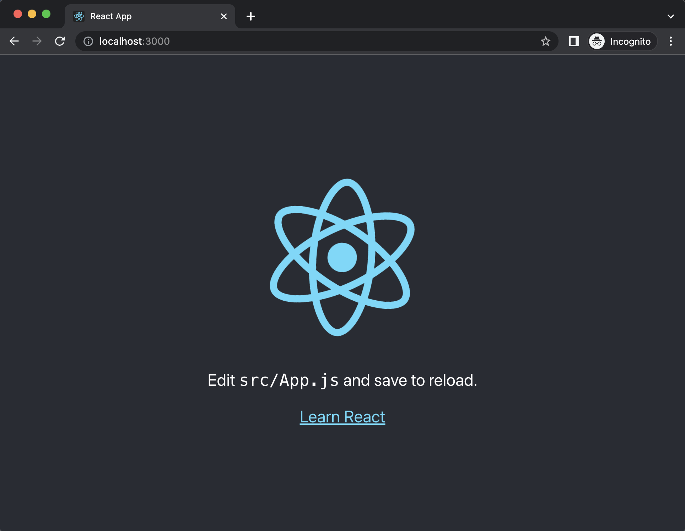
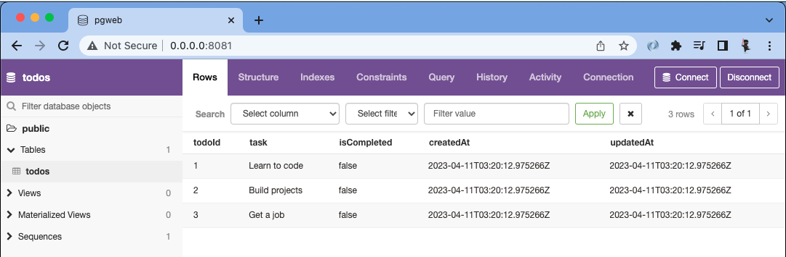

# final-project

A full stack JavaScript solo project.

## Getting Started

---

### Use this template to create a new repo on your GitHub account

1. Click green `Use this template` button, select `Create a new repository`
    1. Under `Owner` select your username
    1. Give your repoitory a name
    1. (Optional) Add a description
    1. Leave repository as `Public`
    1. **DO NOT** Include all branches
    1. Click green `Create repository from template` button

---

### Clone Newly created repo into `lfz-code` and setup `client` *(React App)*

1. From your newly created repo on GitHub, click the green `<> Code` button, then copy **SSH** URL
1. Open `lfz-code`, click on blue `><` button in bottom left of `lfz-code`
    1. Select `Clone Repository in Container Volume...`
    1. Paste **SSH** URL for your repo, click `Clone git repository from URL`
1. Create `client` *(React App)*
    1. From the terminal run `create-react-app`
        ```
        npx create-react-app client
        ```
1. Copy `.env.example` to `.env`
    ```
    cp server/.env.example server/.env
    ```
1. Test your client
    1. In the terminal run
        ```
        cd client
        npm start
        ```
    1. Your browser should open to [http://localhost:3000](http://localhost:3000) and you should see the standard starter page from `create-react-app`
        
1. Initial setup complete
    - **NOTE:** Stop the client at this point before moving onto next steps. Press <kbd>Control</kbd> + <kbd>c</kbd> in terminal to stop client

---

### Run and test full project setup with `client` and `server`

1. Replace the code in `client/src/App.js` with the following code:
    ```JSX
    import { useEffect, useState } from 'react';
    import logo from './logo.svg';
    import './App.css';

    function App() {
      const [serverData, setServerData] = useState("");

      useEffect(() => {
        async function getServerData() {
          const resp = await fetch('/api/hello');
          const data = await resp.json();

          console.log('Data from server:', data);

          setServerData(data.message);
        }

        getServerData();
      }, []);

      return (
        <div className="App">
        <header className="App-header">
            
            <h1>{serverData}</h1>
        </header>
        </div>
      );
    }

    export default App;
    ```
1. Take a minute to look over the code to get an idea of what it is doing.
1. Start your `client` and `server` in separate terminals:
    ```sh
    cd client
    npm start
    ```
    ```sh
    cd server
    npm install
    npm run dev
    ```
1. Go to [http://localhost:3000](http://localhost:3000) in your browser. You should see the message from the server below the React logo, and in the browsers console
    
1. If you see the message from the server in your browser you are good to go, your client and server are communicating.
---

### Setup Database

1. In your browser navigate to the site you used for your database design.
1. Export your database as PostgreSQL, this should generate the SQL code for creating your database tables.
    - Reach out to an instructor if you have any issues with this step
1. Copy the generated SQL code and paste it into `database/schema.sql` below the preexisting sql code in the file. The end result should look something like: *(You will likely have more tables)*
    ```SQL
    set client_min_messages to warning;

    -- DANGER: this is NOT how to do it in the real world.
    -- `drop schema` INSTANTLY ERASES EVERYTHING.
    drop schema "public" cascade;

    create schema "public";

    create table "public"."todos" (
        "todoId"      serial,
        "task"        text           not null,
        "isCompleted" boolean        not null,
        "createdAt"   timestamptz(6) not null default now(),
        "updatedAt"   timestamptz(6) not null default now(),
        primary key ("todoId")
    );
    ```
    - **NOTE:** Database design websites do not do a perfect job of generating SQL, so you may need to make some adjustments to your SQL for it to work correctly. Reach out to your instructor if you need assistance.
1. Now that we have a schema we can create our database.
    1. In a separate terminal, start PostgreSQL
        ```
        sudo service postgresql start
        ```
    1. Create database (replace `name-of-database` with a name of your choosing)
        ```
        createdb name-of-database
        ```
    1. In the `.env` file, in the `DATABASE_URL` replace `changeMe` with the name of your database, from the last step
    1. From the database directory, run `npm run db:import` to create your tables
1. Start pgweb to view your database, and verify your tables were created successfully
    ```
    pgweb --db name-of-database
    ```
1. In pgweb you should see your database and tables, if you do not stop here and reach out to an instructor for help
1. At this point your database is setup and you are good to start using it. However there is no data in your database which isn't necessarily a bad thing, but if you want some starting data in your database you need to add insert statements into the `database/data.sql` file. You can add whatever starting data you need/want. Here is an example:
    ```SQL
    insert into "todos" ("task", "isCompleted")
    values
        ('Learn to code', false),
        ('Build projects', false),
        ('Get a job', false);
    ```
1. After any changes to `database/schema.sql` or `database/data.sql` re-run the `npm run db:import` command to update your database. Use pgweb to verify any changes were successfully applied
    

---

### Available `npm` commands explained

All `npm` commands should be ran from project root directory, there is **NO** need to run any `npm` commands from the `client` folder. Below is an explanation of all included `npm` commands

1. `start`
    - The `start` script starts the Node server in `production` mode, without any file watchers. This script is primarily used for deployment, and not typically used for development purposes.
1. `dev:server`
    - The `dev:server` script starts the Node server in development mode with the `nodemon` file watcher. Any changes to server files will make the server restart. This script is used for development purposes, but is rarely directly used by the developer, it is one of the scripts ran by the `dev` script.
1. `dev:client`
    - The `dev:client` script starts the client (React App) in development mode. It builds your react app in memory, and automatically updates when you save any changes in the `client` folder. This command is actually just running the `npm start` command in the context of the `client` folder. Similar to `dev:server` this script is rarely ran directly by the developer, it is primarily used in the `dev` script.
1. `dev`
    - The `dev` script starts the Node server and the client by executing the `dev:server` and `dev:client` scripts in parallel. This is the primary script you should use for development, it starts your backend and frontend in a single terminal.
1. `build`
    - The `build` script executes `npm run build` in the context of the `client` folder. This builds your React app for production. This is used during deployment, and not commonly needed during development.
1. `db:import`
    - The `npm:import` script executes the `database/schema.sql` file and the `database/data.sql` file to build and populate your database. After any changes to your schema file or data file you need to re-run this command to update your actual database.
1. Not directly used by developer
    1. `preinstall`
        - The `preinstall` script is automatically ran when you run `npm install`. It is executed before the dependencies are installed. Specifically for this project the `preinstall` script is used to install the `client` dependencies. This is important for deployment purposes, to ensure the `client` dependencies get installed onto the deployment server.
    1. `prepare`
        - The `prepare` script is similar to `preinstall`, it is executed before `preinstall`, and `install`. Specifically for this project it is used to install `husky`

---

## Deployment

Once you are ready, deployment instructions can be found [HERE](https://lms.learningfuze.com/code-guides/Learning-Fuze/curriculum/heroku-deployment)
